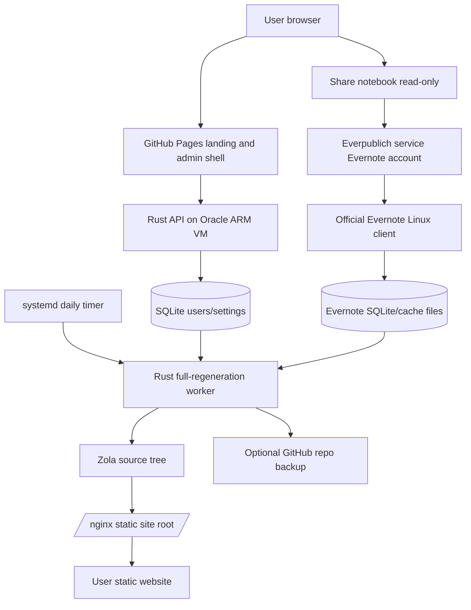

# Everpublich: sync Evernote notebook to a static blog, like postach.io and notesrss.com

[](https://sonarcloud.io/summary/new_code?id=vitaly-zdanevich_everpublich)
[](https://sonarcloud.io/summary/new_code?id=vitaly-zdanevich_everpublich)
[](https://sonarcloud.io/summary/new_code?id=vitaly-zdanevich_everpublich)
[](https://sonarcloud.io/summary/new_code?id=vitaly-zdanevich_everpublich)
[](https://sonarcloud.io/summary/new_code?id=vitaly-zdanevich_everpublich)
[](https://sonarcloud.io/summary/new_code?id=vitaly-zdanevich_everpublich)
[](https://sonarcloud.io/summary/new_code?id=vitaly-zdanevich_everpublich)
[](https://sonarcloud.io/summary/new_code?id=vitaly-zdanevich_everpublich)
[](https://sonarcloud.io/summary/new_code?id=vitaly-zdanevich_everpublich)
[](https://sonarcloud.io/summary/new_code?id=vitaly-zdanevich_everpublich)
[](https://sonarcloud.io/summary/new_code?id=vitaly-zdanevich_everpublich)

Everpublich is a free MVP test pilot that turns an [Evernote](https://evernote.com/) notebook into a fast static [Zola](https://www.getzola.org/) blog or website. It aims to be a better version of [Postach.io](https://postach.io/) and [NotesRSS](https://notesrss.com/): RSS, tags, static search, calendar, podcast feed, media playback, expanded links-to-widgets, backup value, and generated static websites served from one Oracle Cloud ARM VM or mirrored to GitHub.

Free during the test stage.

I use Evernote from 2009 and love it.

## Product

The current MVP avoids Evernote OAuth because Evernote no longer issues legacy API keys to new third-party services. Users share a notebook as read-only to the Everpublich service Evernote account. The official Evernote Linux client syncs that account on the VM, and Everpublich reads the client cache read-only to rebuild websites once per day.

User and site settings live in SQLite, not DynamoDB. Generated static websites and copied media live on the same VM under nginx. The default home page shows full posts, with a SQLite preference to switch the home page to titles only.

The public landing page can still be published to [GitHub Pages](https://docs.github.com/en/pages) from GitHub Actions. Its “Connect Evernote notebook read-only to make a website from it” button should call the VM API. The form asks for a website name, stores a signed admin token in the browser, and shows a spinner while the first build syncs notes and builds the site.

## Architecture



## Evernote access

The official API path is blocked for new Evernote developers today, so the MVP uses a service account and shared notebooks:

- The user creates or chooses a notebook intended for publishing.
- The user shares that notebook read-only to the Everpublich service Evernote account.
- The official Evernote client syncs the shared notebook on the VM.
- The Rust parser reads the local Evernote cache and SQLite files read-only.

Local inspection of the official Linux client shows SQLite databases under `~/.config/Evernote/conduit-storage/.../*.sql`, with note, notebook, tag, attachment, and offline search tables. Note bodies and resource data are also cached under `conduit-fs`. This is a private client storage format, so the parser must be defensive, tested against snapshots, and pinned to a known client version.

The parser must never modify Evernote cache files. For reliable reads, it should copy SQLite databases to a temporary snapshot before querying, especially if the desktop client is running and using WAL files.

## Website features

- Full static regeneration once per day.
- [Zola](https://www.getzola.org/) site generation with `minify_html = true`.
- Use any [Zola theme](https://www.getzola.org/themes/) or add custom CSS.
- I can develop a custom visual theme for you.
- Full posts on the main page by default, with a setting for titles only.
- Static search by default, plus optional Google search.
- RSS and `sitemap.xml`.
- Podcast XML feed from notes tagged `podcast`.
- Tags: every Evernote tag gets a page.
- Notes tagged `page` become dedicated website pages.
- A note tagged `about` becomes the About page.
- If an About note references about.me, the intended behavior is to reuse text, image, and links from that profile and link back to it.
- Images, audio, video, and attachments from Evernote notes are copied to the static site.
- Audio and video are playable in the browser.
- Internal Evernote note links become relative website links.
- Evernote formatting is preserved as HTML, including fonts, sizes, colors, and tables.
- Optional Google Analytics and Yandex Metrica.
- Mobile-friendly design with black dark mode via `prefers-color-scheme`.
- Offline support in the browser.
- Minimal JavaScript, static HTML, minified output, gzip, precompressed assets, and an optional free CDN later through Cloudflare or another DNS/CDN provider.
- Backup value: the generated site and optional GitHub repository become another copy of the Evernote notebook.

## Widget expansion

If a note contains a bare supported URL, Everpublich can expand it into a widget. Current planned and partially implemented providers:

- YouTube
- Instagram
- Pinterest
- Spotify
- Genius
- SoundCloud
- Apple Podcasts
- Vimeo
- Rumble
- Dailymotion
- Bilibili
- Odysee
- Yandex Music

Good extra widget candidates:

- Bandcamp for music and albums
- TikTok for short videos
- Twitch for clips and videos
- Mixcloud for DJ/radio sets
- Internet Archive for books, audio, and video
- GitHub Gist and CodePen for code
- Figma embeds for design files
- Google Maps for places
- Reddit, Mastodon, Bluesky, and Telegram public posts

## GitHub backup

The admin panel can connect GitHub OAuth and switch backup repository visibility between private and public. Private is the safer default. Git is useful because it stores all versions, but if you accidentally publish something private, you also need to fix git history. You can write to Vitaly for help.

## Subdomains

Automatic per-user subdomains are feasible on the VM. After buying the TLD, create DNS records at any registrar or DNS provider:

- `A everpublich.xyz -> VM_PUBLIC_IP`
- `A *.everpublich.xyz -> VM_PUBLIC_IP`

Registering the TLD outside AWS can be cheaper than using Route 53 as a registrar. With the VM design, AWS is not required. Until the domain is bought, test with the VM public IP, a local hosts entry, or a request header:

```sh
curl -H 'Host: demo.everpublich.xyz' http://VM_PUBLIC_IP/
```

For production HTTPS, add Caddy, certbot, or a CDN such as Cloudflare after the domain exists.

## Similar products

- [Postach.io](https://postach.io/) - Evernote-powered blogging platform.
- [NotesRSS](https://notesrss.com/) - Evernote blog service with free blog positioning and CDN hosting.
- [Blot](https://blot.im/) - static sites from a folder, commonly Dropbox or Git.
- [Super](https://super.so/) - websites from Notion pages.
- [Potion](https://potion.so/) - Notion website builder.
- [Feather](https://feather.so/) - Notion-to-blog publishing.

Public market notes from the online check:

- NotesRSS sells simplicity: write in Evernote and publish with a tag.
- NotesRSS also highlights CDN hosting, which supports adding Cloudflare later when the domain exists.
- Evernote API access is the largest platform risk, so the service-account plus desktop-cache path is the practical MVP.
- Evernote free-plan reductions create demand for backup and export-oriented tools.
- I found limited current public review material for Postach.io and NotesRSS, so the product should include a fast feedback loop and author support links from day one.

## Startup feedback

A $5/month SaaS can work if the product solves backup, publishing, and ownership better than a simple blog service. The risk is Evernote platform access and the smaller Evernote power-user market. The strongest MVP angle is not “blogging only”; it is “publish and back up an Evernote notebook as a fast static website”.

Feature ideas:

- Import from Evernote export files (`.enex`) for users who do not want to share a notebook.
- Custom domain setup wizard.
- Search engine indexing diagnostics.
- Private site mode with password or signed URLs.
- Email newsletter from RSS.
- Webmention support.
- Markdown export and ZIP backup.
- Broken-link checker.
- AI-generated summaries and tag cleanup, optional and transparent.
- Paid custom theme setup.

Related startup ideas:

- Notion-to-static-site with Git backup and clean export.
- Google Keep export-to-blog, but Google Keep has weaker API/export ergonomics.
- Obsidian vault to static site with media, backlinks, and private sections.
- “Personal knowledge backup monitor” that checks Evernote, Notion, Google Drive, GitHub, and Telegram exports.
- Static podcast generator from folders, notebooks, or YouTube playlists.
- Hosted “about me” page that syncs from existing profiles and notes.
- Small-business knowledge base from Notion, Evernote, or Google Docs to static site.
- Personal archive search across Evernote exports, Telegram exports, browser bookmarks, and local files.

Notion is worth supporting later because the market is larger and website builders around Notion already proved demand. Evernote is a better first niche for you because you have long-term product intuition and related projects.

## Future plans

If this free MVP gets more than 100 GitHub stars:

- Other static website generators.
- From-Evernote-to-WordPress sync support.
- Sync to Telegram channel.
- Automatic backend translation to different languages.
- More import sources, including Notion and Obsidian.

You can also send your ideas.

## Other Evernote projects by Vitaly

- [bot_telegram_evernote](https://gitlab.com/vitaly-zdanevich/bot_telegram_evernote) - Telegram bot for searching Evernote notes and saving Telegram attachments into Evernote.
- [pinterest-saves-to-evernote](https://github.com/vitaly-zdanevich/pinterest-saves-to-evernote) - saves Pinterest content to Evernote.
- [yandex-music-likes-to-evernote](https://github.com/vitaly-zdanevich/yandex-music-likes-to-evernote) - syncs Yandex Music likes to Evernote.
- [geeknote](https://github.com/vitaly-zdanevich/geeknote) - Evernote CLI.
- [reeknote](https://gitlab.com/vitaly-zdanevich/reeknote) - Rust rewrite of an Evernote CLI.

Related project:

- [telegram_channel_to_static_website](https://github.com/vitaly-zdanevich/telegram_channel_to_static_website) - public Telegram channel to static Zola website. Everpublich takes visual and product ideas from it, including the calendar.

## Local development

```sh
cargo test
cargo run --bin everpublich-cli -- mock-site --output build/mock-site
zola --root build/mock-site serve
```

The end-to-end HTML test runs `zola build`, so install [Zola](https://www.getzola.org/documentation/getting-started/installation/) before `cargo test --all-targets`.

## Oracle Cloud ARM VM deployment

The Terraform in `infra/` provisions one OCI Ampere A1 ARM VM, a VCN, a public subnet, HTTP/HTTPS/SSH security rules, nginx, SQLite, a daily systemd timer, and directories for the official Evernote client cache and generated websites.

Oracle’s current Always Free documentation says Ampere A1 gives 2 OCPUs and 12 GB RAM total for Always Free tenancies, and the account has 200 GB total Always Free block storage. This repo defaults to one `VM.Standard.A1.Flex` instance using those free limits.

Create `infra/terraform.tfvars` from `infra/terraform.tfvars.example`, set your OCI OCIDs and an Always Free eligible Ubuntu AArch64 image OCID, then:

```sh
./scripts/deploy.sh
```

If OCI reports out of host capacity, try another `availability_domain_index` or retry later. Keep `region` set to your OCI home region for Always Free resources.

Scripts:

- `scripts/deploy.sh` runs Terraform for the Oracle Cloud VM.
- `scripts/update-code.sh` SSHes into the VM, pulls the repo, builds `everpublich-cli` on ARM, installs it, and starts the sync service.
- `scripts/show-logs.sh` reads `journalctl` logs for `everpublich-sync.service` over SSH.
- `scripts/build_pages.py` builds the GitHub Pages artifact into `dist/pages`.

Evernote AppImage login is interactive. After deployment, connect with SSH X forwarding, run the helper in your forwarded X session, log in once, then restart the background service:

```sh
ssh -Y ubuntu@VM_PUBLIC_IP
/opt/everpublich/bin/evernote-run-ssh-x
sudo systemctl start evernote-client.service
```

Example:

```sh
EVERPUBLICH_SSH_HOST=VM_PUBLIC_IP ./scripts/update-code.sh
EVERPUBLICH_SSH_HOST=VM_PUBLIC_IP ./scripts/show-logs.sh
```

CI publishes GitHub Pages on pushes to `main`. Optional repository variables:

- `EVERPUBLICH_PAGES_API_BASE_URL` - VM API base URL used by the connect/admin browser calls.
- `EVERPUBLICH_PAGES_BASE_DOMAIN` - domain shown in the landing page subdomain hint.

CI also generates `coverage/lcov.info` with `cargo-llvm-cov`; `sonar-project.properties` points SonarCloud at that report.

## Documentation links

- [Evernote developer documentation](https://dev.evernote.com/doc/)
- [Evernote notebook sharing](https://dev.evernote.com/doc/articles/notebook_sharing.php)
- [Zola documentation](https://www.getzola.org/documentation/getting-started/overview/)
- [Zola themes](https://www.getzola.org/themes/)
- [Oracle Cloud Always Free resources](https://docs.oracle.com/en-us/iaas/Content/FreeTier/freetier_topic-Always_Free_Resources.htm)
- [Terraform OCI provider](https://registry.terraform.io/providers/oracle/oci/latest/docs)
- [OCI compute instances](https://docs.oracle.com/en-us/iaas/Content/Compute/Concepts/computeoverview.htm)
- [SQLite documentation](https://www.sqlite.org/docs.html)
- [nginx documentation](https://nginx.org/en/docs/)

## Support

This service is a free MVP test pilot. Support is available from the author, Vitaly Zdanevich:

- Telegram: [@vitaly_zdanevich](https://t.me/vitaly_zdanevich)
- Email: [zdanevich.vitaly@ya.ru](mailto:zdanevich.vitaly@ya.ru)
- Tickets: [GitHub issues](https://github.com/vitaly-zdanevich/everpublich/issues)
