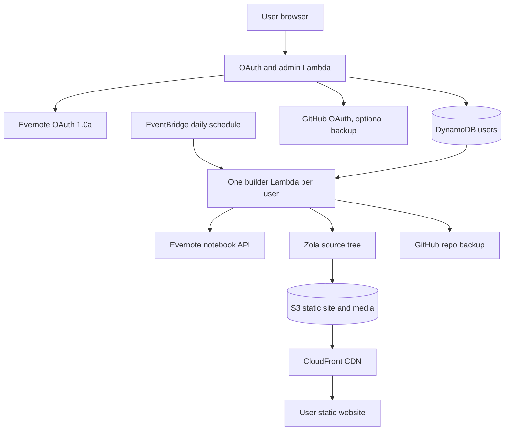

# Everpublich: sync Evernote notebook to a static blog, like postach.io and notesrss.com

Everpublich is a free MVP test pilot that turns an [Evernote](https://evernote.com/) notebook into a fast static [Zola](https://www.getzola.org/) website. It is inspired by [Postach.io](https://postach.io/) and [NotesRSS](https://notesrss.com/), but the output is a plain static site hosted from S3 behind a CDN, with a GitHub backup option.

I use Evernote from 2009 and love it.

## Product

Everpublich asks for Evernote OAuth access, reads one selected notebook, and fully regenerates the user website once per day. The generated site has RSS, `sitemap.xml`, static search, tag pages, an About page, a calendar, media playback, and a podcast feed for notes tagged `podcast`.

The default home page shows full posts. A per-user DynamoDB preference can switch the home page to titles only. Preferences live in the DynamoDB user item, one item per SaaS user.

The landing page has one primary action: “Connect Evernote notebook read-only to make a website from it”. The form asks for a website name, returns the future website URL, stores an admin token in the browser, and shows a spinner while the first build downloads notes and builds the site.

## Architecture



## Evernote access

Evernote’s developer documentation still describes OAuth 1.0a and expiring access tokens. API keys can be Basic, Full, or App Notebook. Basic access does not read existing notes; Full access reads and updates notes; App Notebook limits access to a single notebook while keeping full notebook permissions. For this product, the best path is App Notebook authorization when Evernote approves the API key.

The alternative mode is also supported in the data model: a user shares a notebook read-only to the Everpublich service Evernote account, and the daily builder reads shared notebooks from that service account. This is attractive because the user does not need to grant a broad token, but it needs clear onboarding and testing against Evernote shared-notebook API behavior.

The browser does not store the raw Evernote token. The backend stores the token encrypted with AES-256-GCM using `EVERPUBLICH_TOKEN_SECRET`. This avoids paid AWS KMS during the pilot, but it means the Lambda environment secret must be protected. The browser receives a signed admin token derived from the current Evernote token fingerprint; rotating the Evernote token invalidates old admin sessions.

## Website features

- Full static regeneration once per day.
- One Lambda per user, scheduled with EventBridge.
- [Zola](https://www.getzola.org/) site generation with `minify_html = true`.
- Use any [Zola theme](https://www.getzola.org/themes/) or add custom CSS.
- I can develop a custom visual theme for you.
- Full posts on the main page by default, with a setting for titles only.
- Static search by default, plus optional Google search.
- RSS and `sitemap.xml`.
- Podcast XML feed from notes tagged `podcast`.
- Tags: every Evernote tag gets a page.
- Notes tagged `page` become dedicated website pages.
- A note tagged `about` becomes the About page.
- If an About note references about.me, the intended behavior is to reuse text, image, and links from that profile and link back to it.
- Images, audio, video, and attachments from Evernote notes are copied to the static site.
- Audio and video are playable in the browser.
- Internal Evernote note links become relative website links.
- Evernote formatting is preserved as HTML, including fonts, sizes, colors, and tables.
- Optional Google Analytics and Yandex Metrica.
- Mobile-friendly design with black dark mode via `prefers-color-scheme`.
- Minimal JavaScript, static HTML, minified output, CDN delivery, and Brotli from CloudFront.
- Backup value: the generated site and optional GitHub repository become another copy of the Evernote notebook.

## Widget expansion

If a note contains a bare supported URL, Everpublich can expand it into a widget. Current planned and partially implemented providers:

- YouTube
- Instagram
- Pinterest
- Spotify
- Genius
- SoundCloud
- Apple Podcasts
- Vimeo
- Rumble
- Dailymotion
- Bilibili
- Odysee
- Yandex Music

Good extra widget candidates:

- Bandcamp for music and albums
- TikTok for short videos
- Twitch for clips and videos
- Mixcloud for DJ/radio sets
- Internet Archive for books, audio, and video
- GitHub Gist and CodePen for code
- Figma embeds for design files
- Google Maps for places
- Reddit, Mastodon, Bluesky, and Telegram public posts

## GitHub backup

The admin panel can connect GitHub OAuth and switch backup repository visibility between private and public. Private is the safer default. Git is useful because it stores all versions, but if you accidentally publish something private, you also need to fix git history. You can write to Vitaly for help.

## Subdomains

Automatic per-user subdomains are feasible. The low-maintenance setup is a wildcard DNS record like `*.everpublich.example` pointing to CloudFront, then CloudFront rewrites the host to the user prefix in S3. If you register the TLD outside AWS, it can be cheaper than Route 53 registrar pricing. You can still use CloudFront and S3; just create DNS records at your registrar or DNS provider. If DNS is in Route 53, Terraform can create the wildcard record.

For production HTTPS on a custom wildcard domain, use an ACM certificate in `us-east-1` for `*.your-domain`. Terraform accepts `acm_certificate_arn` after you validate the certificate.

## Similar products

- [Postach.io](https://postach.io/) - Evernote-powered blogging platform.
- [NotesRSS](https://notesrss.com/) - Evernote blog service with free blog positioning and CDN hosting.
- [Blot](https://blot.im/) - static sites from a folder, commonly Dropbox or Git.
- [Super](https://super.so/) - websites from Notion pages.
- [Potion](https://potion.so/) - Notion website builder.
- [Feather](https://feather.so/) - Notion-to-blog publishing.

Public market notes from the online check:

- NotesRSS sells simplicity: write in Evernote and publish with a tag.
- NotesRSS also highlights CDN hosting, which supports the Everpublich S3 plus CloudFront direction.
- Evernote API access needs manual API-key approval and access justification.
- Evernote free-plan reductions create demand for backup and export-oriented tools.
- I found limited current public review material for Postach.io/NotesRSS, so the product should include a fast feedback loop and author support links from day one.

## Startup feedback

A $5/month SaaS can work if the product solves backup, publishing, and ownership better than a simple blog service. The risk is Evernote API approval and the smaller Evernote power-user market. The strongest MVP angle is not “blogging only”; it is “publish and back up an Evernote notebook as a fast static website”.

Feature ideas:

- Import from Evernote export files (`.enex`) for users who do not want OAuth.
- One-click migration from Postach.io and NotesRSS.
- Custom domain setup wizard.
- Search engine indexing diagnostics.
- Private site mode with password or signed URLs.
- Email newsletter from RSS.
- Webmention support.
- Markdown export and ZIP backup.
- Broken-link checker.
- AI-generated summaries and tag cleanup, optional and transparent.
- Paid custom theme setup.

Related startup ideas:

- Notion-to-static-site with Git backup and clean export.
- Google Keep export-to-blog, but Google Keep has weaker API/export ergonomics.
- Obsidian vault to static site with media, backlinks, and private sections.
- “Personal knowledge backup monitor” that checks Evernote, Notion, Google Drive, GitHub, and Telegram exports.
- Static podcast generator from folders, notebooks, or YouTube playlists.
- Hosted “about me” page that syncs from existing profiles and notes.
- Small-business knowledge base from Notion/Evernote/Google Docs to static site.
- Personal archive search across Evernote exports, Telegram exports, browser bookmarks, and local files.

Notion is worth supporting later because the market is larger and website builders around Notion already proved demand. Evernote is a better first niche for you because you have long-term product intuition and related projects.

## Future plans

If this free MVP gets more than 100 GitHub stars:

- Other static website generators.
- From-Evernote-to-WordPress sync support.
- Sync to Telegram channel.
- Automatic backend translation to different languages.
- More import sources, including Notion and Obsidian.

You can also send your ideas.

## Other Evernote projects by Vitaly

- [bot_telegram_evernote](https://gitlab.com/vitaly-zdanevich/bot_telegram_evernote) - Telegram bot for searching Evernote notes and saving Telegram attachments into Evernote.
- [pinterest-saves-to-evernote](https://github.com/vitaly-zdanevich/pinterest-saves-to-evernote) - saves Pinterest content to Evernote.
- [yandex-music-likes-to-evernote](https://github.com/vitaly-zdanevich/yandex-music-likes-to-evernote) - syncs Yandex Music likes to Evernote.
- [geeknote](https://github.com/vitaly-zdanevich/geeknote) - Evernote CLI.
- [reeknote](https://gitlab.com/vitaly-zdanevich/reeknote) - Rust rewrite of an Evernote CLI.

Related project:

- [telegram_channel_to_static_website](https://github.com/vitaly-zdanevich/telegram_channel_to_static_website) - public Telegram channel to static Zola website. Everpublich takes visual and product ideas from it, including the calendar.

## Local development

```sh
cargo test
cargo run --bin everpublich-cli -- mock-site --output build/mock-site
zola --root build/mock-site serve
```

The end-to-end HTML test runs `zola build`, so install [Zola](https://www.getzola.org/documentation/getting-started/installation/) before `cargo test --all-targets`.

## AWS deployment

Create `infra/terraform.tfvars` from `infra/terraform.tfvars.example`, then:

```sh
./scripts/deploy.sh
```

Scripts:

- `scripts/build-lambda.sh` builds `everpublich-lambda` and `everpublich-worker` for `aarch64-unknown-linux-gnu` with `RUST_TARGET_CPU=neoverse-n1`.
- `scripts/deploy.sh` builds and applies Terraform.
- `scripts/update-code.sh` updates Lambda code without changing Terraform-managed resources.
- `scripts/show-logs.sh` reads recent CloudWatch logs.
- `scripts/embed_readme.py` embeds README text into the landing page during CI.

CI also generates `coverage/lcov.info` with `cargo-llvm-cov`; `sonar-project.properties` points SonarCloud at that report.

## Documentation links

- [Evernote developer documentation](https://dev.evernote.com/doc/)
- [Evernote OAuth](https://dev.evernote.com/doc/articles/authentication.php)
- [Evernote API permissions](https://dev.evernote.com/doc/articles/permissions.php)
- [Evernote notebook sharing](https://dev.evernote.com/doc/articles/notebook_sharing.php)
- [Zola documentation](https://www.getzola.org/documentation/getting-started/overview/)
- [Zola themes](https://www.getzola.org/themes/)
- [AWS Lambda Rust runtime](https://github.com/awslabs/aws-lambda-rust-runtime)
- [Terraform AWS provider](https://registry.terraform.io/providers/hashicorp/aws/latest/docs)
- [Amazon S3](https://docs.aws.amazon.com/s3/)
- [Amazon CloudFront](https://docs.aws.amazon.com/cloudfront/)
- [Amazon DynamoDB](https://docs.aws.amazon.com/dynamodb/)

## Support

This service is a free MVP test pilot. Support is available from the author, Vitaly Zdanevich:

- Telegram: [@vitaly_zdanevich](https://t.me/vitaly_zdanevich)
- Email: [zdanevich.vitaly@ya.ru](mailto:zdanevich.vitaly@ya.ru)
- Tickets: [GitHub issues](https://github.com/vitaly-zdanevich/everpublich/issues)
