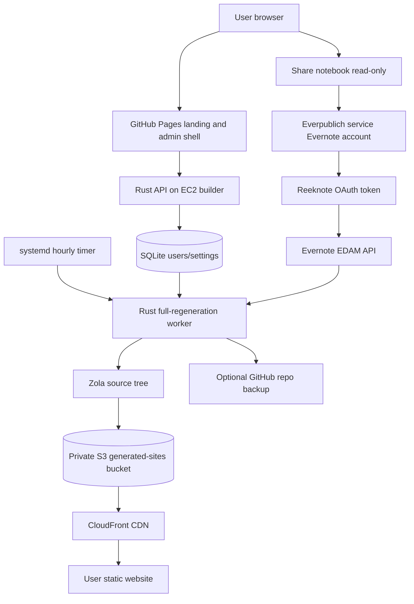

# Everpublich: sync Evernote notebook to a static blog, like postach.io and notesrss.com

[](https://sonarcloud.io/summary/new_code?id=vitaly-zdanevich_everpublich)
[](https://sonarcloud.io/summary/new_code?id=vitaly-zdanevich_everpublich)
[](https://sonarcloud.io/summary/new_code?id=vitaly-zdanevich_everpublich)
[](https://sonarcloud.io/summary/new_code?id=vitaly-zdanevich_everpublich)
[](https://sonarcloud.io/summary/new_code?id=vitaly-zdanevich_everpublich)
[](https://sonarcloud.io/summary/new_code?id=vitaly-zdanevich_everpublich)
[](https://sonarcloud.io/summary/new_code?id=vitaly-zdanevich_everpublich)
[](https://sonarcloud.io/summary/new_code?id=vitaly-zdanevich_everpublich)
[](https://sonarcloud.io/summary/new_code?id=vitaly-zdanevich_everpublich)
[](https://sonarcloud.io/summary/new_code?id=vitaly-zdanevich_everpublich)
[](https://sonarcloud.io/summary/new_code?id=vitaly-zdanevich_everpublich)

Everpublich is a free MVP test pilot that turns an [Evernote](https://evernote.com/) notebook into a fast static [Zola](https://www.getzola.org/) blog or website. It aims to be a better version of [Postach.io](https://postach.io/) and [NotesRSS](https://notesrss.com/): RSS, tags, static search, calendar, podcast feed, media playback, expanded links-to-widgets, backup value, and generated static websites served from S3 through CloudFront or mirrored to GitHub.

Free during the test stage.

I use Evernote from 2009 and love it.

## Product

The current MVP cannot register a new Evernote OAuth application because Evernote no longer issues legacy API keys to new third-party services. Users share a notebook read-only to the Everpublich service Evernote account. The service account is authorized once with [Reeknote](https://github.com/vitaly-zdanevich/reeknote), and the EC2 builder reads shared notebooks through the Evernote API to rebuild websites once per hour.

User and site settings live in SQLite, not DynamoDB. Generated static websites and copied media are synced to a private S3 bucket and served through CloudFront. The default home page shows full posts, with a SQLite preference to switch the home page to titles only.

The public landing page can still be published to [GitHub Pages](https://docs.github.com/en/pages) from GitHub Actions. For the free MVP, it asks users to share a notebook read-only with `share@everpublich.my`; Everpublich will email the generated website link after the first sync.

## Architecture



## Evernote access

New Evernote API applications are blocked for new developers today, so the MVP uses a service account, shared notebooks, and a legacy OAuth application token obtained through Reeknote:

- The user creates or chooses a notebook intended for publishing.
- The user shares that notebook read-only to the Everpublich service Evernote account.
- Reeknote authorizes the service account and stores the Evernote OAuth token.
- Everpublich uses that token to read linked/shared notebooks through the Evernote EDAM API.
- Evernote does not expose tags for shared notes reliably, so Everpublich parses final-line `#tags` and `slug:` metadata from note content.

The old official-client cache reader remains as a fallback/debug path, but the API path is preferred because it avoids GUI login, black Electron windows, lazy attachment downloads, and private client SQLite formats.

## Website features

- Full static regeneration once per hour.
- [Zola](https://www.getzola.org/) site generation with `minify_html = true`.
- Use any [Zola theme](https://www.getzola.org/themes/) or add custom CSS.
- I can develop a custom visual theme for you.
- Full posts on the main page by default, with a setting for titles only.
- Static search by default, plus optional Google search.
- RSS and `sitemap.xml`.
- Podcast XML feed from notes tagged `podcast`.
- Tags: every Evernote tag gets a page.
- Notes tagged `page` become dedicated website pages.
- A note titled `everpublich:about` becomes the About page.
- A note titled `everpublish:Something` becomes a dedicated page named `Something`.
- A note titled `everpublich:#tag` adds a top navigation link to that tag; the note content becomes the link tooltip.
- A note titled `everpublich:config` can set notebook options like `widgets: off` and can embed fenced `css` or `js` code blocks into the generated website.
- If an About note references about.me, the intended behavior is to reuse text, image, and links from that profile and link back to it.
- Images, audio, video, 3D models, text previews, and attachments from Evernote notes are copied to the static site.
- HEIC/HEIF, DNG, TIFF, BMP, JPEG 2000, JPEG XL, PSD, RAW, and other browser-hostile images are served as AVIF or extracted JPEG, so originals can stay in Evernote.
- SVG is rendered directly; Adobe Illustrator, EPS, PS, and compressed SVG files get an AVIF preview plus the original file download.
- Audio and video are playable in the browser.
- GLB/GLTF, STL, OBJ, PLY, 3MF, DAE, FBX, 3DM, VOX, VTK/VTP, XYZ, and G-code 3D attachments are rotatable in the browser when browser loaders can read them.
- PDF, Text, Markdown, RTF, logs, subtitle, CSV, JSON, YAML, TOML, and XML attachments are shown in a closed preview block with a download link.
- ZIP, RAR, and TAR-family archives are copied and can show a closed file tree when the server can inspect them.
- Internal Evernote note links become relative website links.
- Evernote formatting is preserved as HTML, including fonts, sizes, colors, and tables.
- Optional Google Analytics and Yandex Metrica.
- Mobile-friendly design with black dark mode via `prefers-color-scheme`.
- Offline support in the browser.
- Minimal JavaScript, static HTML, minified output, max-Brotli text objects in S3, and CloudFront delivery.
- Backup value: the generated site and optional GitHub repository become another copy of the Evernote notebook.

## Widget expansion

If a note contains a bare supported URL, Everpublich can expand it into a widget. Current providers:

- YouTube
- Instagram
- Pinterest
- Spotify
- Genius
- SoundCloud
- Apple Podcasts
- Vimeo
- Rumble
- Dailymotion
- Bilibili
- Odysee
- Yandex Music
- Steam
- VK playlists
- Mastodon posts and static profile cards
- Reddit posts, subreddit widgets, and static subreddit cards as fallback

Good extra widget candidates:

- Bandcamp for music and albums
- TikTok for short videos
- Twitch for clips and videos
- Mixcloud for DJ/radio sets
- Internet Archive for books, audio, and video
- GitHub Gist and CodePen for code
- Figma embeds for design files
- Google Maps for places
- Bluesky and Telegram public posts

## `everpublich:config` Note

Create a note titled `everpublich:config` in the shared notebook. It is not rendered as a public page; it controls the generated website.

Supported line-based options:

```text
widgets: off
widgets: on
widget: youtube off
widget: spotify on
widget youtube: off
previews: off
previews: on
preview: poster.psd off
preview poster.psd: off
```

- `widgets: off` disables all link-to-widget expansion.
- `widget: youtube off` disables one widget provider while keeping other providers enabled. Use provider keys like `youtube`, `spotify`, `genius`, `soundcloud`, `apple-podcasts`, `vimeo`, `reddit`, `mastodon`, `steam`, or `vk-playlist`.
- `previews: off` disables attachment previews and renders download links instead.
- `preview: poster.psd off` disables preview rendering for one file, matched case-insensitively by generated preview filename or original filename.

You can also add custom CSS or JavaScript with fenced code blocks:

````markdown
```css
body {
	color: #222;
}
```

```js
console.log('custom Everpublich script');
```
````

## GitHub backup

The admin panel can connect GitHub OAuth and switch backup repository visibility between private and public. Private is the safer default. Git is useful because it stores all versions, but if you accidentally publish something private, you also need to fix git history. You can write to Vitaly for help.

## Subdomains

Automatic per-user subdomains are feasible through CloudFront. After buying the TLD and creating an ACM certificate in `us-east-1`, set `cloudfront_aliases` and create DNS records at any registrar or DNS provider:

- `CNAME *.everpublich.my -> CLOUDFRONT_DOMAIN`
- `ALIAS/ANAME everpublich.my -> CLOUDFRONT_DOMAIN`, if you decide to move the root domain from GitHub Pages later

Registering the TLD outside AWS can be cheaper than using Route 53 as a registrar. The landing page stays on GitHub Pages. Until CloudFront aliases are configured, test generated sites with the CloudFront URL, for example `https://CLOUDFRONT_DOMAIN/demo/`.

Everpublich uploads text-like generated files with maximum Brotli compression and `Content-Encoding: br`, while leaving already-compressed media and archives untouched.

## Similar products

- [Postach.io](https://postach.io/) - Evernote-powered blogging platform.
- [NotesRSS](https://notesrss.com/) - Evernote blog service with free blog positioning and CDN hosting.
- [Blot](https://blot.im/) - static sites from a folder, commonly Dropbox or Git.
- [Super](https://super.so/) - websites from Notion pages.
- [Potion](https://potion.so/) - Notion website builder.
- [Feather](https://feather.so/) - Notion-to-blog publishing.

Public market notes from the online check:

- NotesRSS sells simplicity: write in Evernote and publish with a tag.
- NotesRSS also highlights CDN hosting, which supports adding Cloudflare later when the domain exists.
- Evernote API access is the largest platform risk, so the service-account plus desktop-cache path is the practical MVP.
- Evernote free-plan reductions create demand for backup and export-oriented tools.
- I found limited current public review material for Postach.io and NotesRSS, so the product should include a fast feedback loop and author support links from day one.

## Startup feedback

A $5/month SaaS can work if the product solves backup, publishing, and ownership better than a simple blog service. The risk is Evernote platform access and the smaller Evernote power-user market. The strongest MVP angle is not “blogging only”; it is “publish and back up an Evernote notebook as a fast static website”.

Feature ideas:

- Import from Evernote export files (`.enex`) for users who do not want to share a notebook.
- Custom domain setup wizard.
- Search engine indexing diagnostics.
- Private site mode with password or signed URLs.
- Email newsletter from RSS.
- Webmention support.
- Markdown export and ZIP backup.
- Broken-link checker.
- AI-generated summaries and tag cleanup, optional and transparent.
- Paid custom theme setup.

Related startup ideas:

- Notion-to-static-site with Git backup and clean export.
- Google Keep export-to-blog, but Google Keep has weaker API/export ergonomics.
- Obsidian vault to static site with media, backlinks, and private sections.
- “Personal knowledge backup monitor” that checks Evernote, Notion, Google Drive, GitHub, and Telegram exports.
- Static podcast generator from folders, notebooks, or YouTube playlists.
- Hosted “about me” page that syncs from existing profiles and notes.
- Small-business knowledge base from Notion, Evernote, or Google Docs to static site.
- Personal archive search across Evernote exports, Telegram exports, browser bookmarks, and local files.

Notion is worth supporting later because the market is larger and website builders around Notion already proved demand. Evernote is a better first niche for you because you have long-term product intuition and related projects.

## Future plans

If this free MVP gets more than 100 GitHub stars:

- Other static website generators.
- From-Evernote-to-WordPress sync support.
- Sync to Telegram channel.
- Automatic backend translation to different languages.
- More import sources, including Notion and Obsidian.

You can also send your ideas.

## Other Evernote projects by Vitaly

- [bot_telegram_evernote](https://gitlab.com/vitaly-zdanevich/bot_telegram_evernote) - Telegram bot for searching Evernote notes and saving Telegram attachments into Evernote.
- [pinterest-saves-to-evernote](https://github.com/vitaly-zdanevich/pinterest-saves-to-evernote) - saves Pinterest content to Evernote.
- [yandex-music-likes-to-evernote](https://github.com/vitaly-zdanevich/yandex-music-likes-to-evernote) - syncs Yandex Music likes to Evernote.
- [geeknote](https://github.com/vitaly-zdanevich/geeknote) - Evernote CLI.
- [reeknote](https://gitlab.com/vitaly-zdanevich/reeknote) - Rust rewrite of an Evernote CLI.

Related project:

- [telegram_channel_to_static_website](https://github.com/vitaly-zdanevich/telegram_channel_to_static_website) - public Telegram channel to static Zola website. Everpublich takes visual and product ideas from it, including the calendar.

## Local development

```sh
cargo test
cargo run --bin everpublich-cli -- mock-site --output build/mock-site
zola --root build/mock-site serve
```

The end-to-end HTML test runs `zola build`, so install [Zola](https://www.getzola.org/documentation/getting-started/installation/) before `cargo test --all-targets`.

## AWS EC2 builder deployment

The Terraform in `infra/` provisions one EC2 builder, a VPC, a public IPv6 subnet, a private S3 bucket for generated static websites, CloudFront with Origin Access Control, SQLite, an hourly systemd timer, and directories for generated websites and temporary Evernote API downloads.

The default instance is `m7i-flex.large` with 2 vCPU and 8 GiB RAM. Public IPv4 is disabled by default because AWS charges hourly for it. IPv6 is enabled by default. The repo keeps the classic 30 GiB EBS allowance split as 10 GiB root plus a 20 GiB Btrfs data volume mounted with `compress-force=zstd:15`.

AWS currently lists CloudFront Free plan allowances as 100 GB data transfer, 1M requests, and 5 GB included S3 storage per month. Generated sites should stay inside that during the MVP if media usage is modest.

Create `infra/terraform.tfvars` from `infra/terraform.tfvars.example`, review the region and SSH key path, then:

```sh
./scripts/deploy.sh
```

If bootstrap cannot download GitHub, Zola, or AWS CLI assets over IPv6, temporarily set `associate_public_ipv4 = true`, apply, complete bootstrap, then switch it back to `false` to avoid the public IPv4 hourly charge.

Scripts:

- `scripts/deploy.sh` runs Terraform for the AWS EC2/S3/CloudFront stack.
- `scripts/update-code.sh` builds `everpublich-cli` locally in Docker by default with `-C target-cpu=sapphirerapids` for the current `m7i-flex.large` EC2 CPU, uploads only that binary to the EC2 builder, installs it, and starts the sync service. Set `EVERPUBLICH_RUSTFLAGS=''` for a portable build, or use `EVERPUBLICH_BUILD_MODE=local` only when the local libc is compatible with the VM.
- `scripts/show-logs.sh` reads `journalctl` logs for `everpublich-sync.service` over SSH.
- `scripts/build_pages.py` builds the GitHub Pages artifact into `dist/pages`.

Authorize the Evernote service account with Reeknote, then put the resulting OAuth token into `/etc/everpublich/everpublich.env` as `EVERNOTE_SERVICE_TOKEN`. Reeknote can use a legacy OAuth application by setting `REEKNOTE_EVERNOTE_CONSUMER_KEY`, `REEKNOTE_EVERNOTE_CONSUMER_SECRET`, and `REEKNOTE_EVERNOTE_OAUTH_CALLBACK=nnoauth` during `reeknote login`.

```sh
sudo -H -u everpublich env HOME=/var/lib/everpublich \
	REEKNOTE_APP_DIR=/var/lib/everpublich/.reeknote \
	REEKNOTE_EVERNOTE_CONSUMER_KEY=... \
	REEKNOTE_EVERNOTE_CONSUMER_SECRET=... \
	REEKNOTE_EVERNOTE_OAUTH_CALLBACK=nnoauth \
	/opt/everpublich/bin/reeknote login
```

After login, copy the stored token into the service env file without printing it in logs, then restart the sync timer/service.

```sh
EVERPUBLICH_SSH_HOST=EC2_HOST ./scripts/update-code.sh
EVERPUBLICH_SSH_HOST=EC2_HOST ./scripts/show-logs.sh
```

CI publishes GitHub Pages on pushes to `main`. Optional repository variables:

- `EVERPUBLICH_PAGES_API_BASE_URL` - VM API base URL used by the connect/admin browser calls.

CI also generates `coverage/lcov.info` with `cargo-llvm-cov`; `sonar-project.properties` points SonarCloud at that report.

## Documentation links

- [Evernote developer documentation](https://dev.evernote.com/doc/)
- [Evernote notebook sharing](https://dev.evernote.com/doc/articles/notebook_sharing.php)
- [Zola documentation](https://www.getzola.org/documentation/getting-started/overview/)
- [Zola themes](https://www.getzola.org/themes/)
- [Amazon EC2 instance types](https://aws.amazon.com/ec2/instance-types/)
- [Amazon EBS pricing](https://aws.amazon.com/ebs/pricing/)
- [Amazon S3 pricing](https://aws.amazon.com/s3/pricing/)
- [Amazon CloudFront pricing](https://aws.amazon.com/cloudfront/pricing/)
- [CloudFront compression](https://docs.aws.amazon.com/AmazonCloudFront/latest/DeveloperGuide/ServingCompressedFiles.html)
- [CloudFront Origin Access Control for S3](https://docs.aws.amazon.com/AmazonCloudFront/latest/DeveloperGuide/private-content-restricting-access-to-s3.html)
- [Terraform AWS provider](https://registry.terraform.io/providers/hashicorp/aws/latest/docs)
- [SQLite documentation](https://www.sqlite.org/docs.html)
- [Btrfs documentation](https://btrfs.readthedocs.io/)

## Support

This service is a free MVP test pilot. Support is available from the author, Vitaly Zdanevich:

- Telegram: [@vitaly_zdanevich](https://t.me/vitaly_zdanevich)
- Email: [zdanevich.vitaly@ya.ru](mailto:zdanevich.vitaly@ya.ru)
- Tickets: [GitHub issues](https://github.com/vitaly-zdanevich/everpublich/issues)
